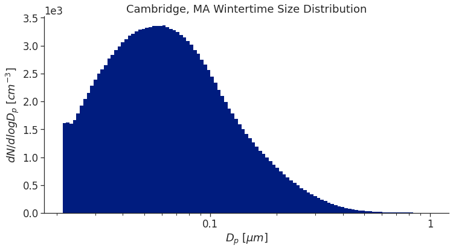
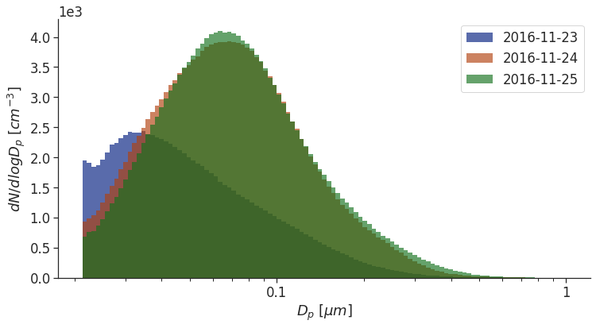

=================
Quick Start Guide
=================

Importing Data
==============

You'll first have to import your data into a Pandas DataFrame.  You can read more on that `here <https://pandas.pydata.org/docs/getting_started/intro_tutorials/02_read_write.html>`_. Timestamps should index the rows.

If your data comes from a particle sizer with an existing class, ``AlphasenseOPCN3`` for example, you can simply instantiate with the data - bin information will already be set up

.. code-block:: Python

   import pandas as pd
   import smps
   df = pd.read_csv("data/mydata.csv")
   my_smps_model = smps.models.AlphasenseOPCN3(data=df)
   
If the bins are titled something other than 'bin0', 'bin1', 'bin2' etc. you will need to also give a list of the bin names

.. code-block:: Python

   import pandas as pd
   import smps
   df = pd.read_csv("data/mydata.csv")
   my_smps_model = smps.models.AlphasenseOPCN3(data=df, bin_labels=my_list_of_labels)
   
If your data comes from a particle sizer without an existing class you can load it into the :ref:`smps.models.GenericParticleSizer<the-gps-class>` or ``smps.models.SMPS`` class, and use :ref:`smps.utils.make_bins<the-make_bins>` to set up the bins.

Computing Statistics
====================

You can see all the the meta information that was held in the SMPS file by evaluating ``my_smps_model.meta``.

:ref:`my_smps_model.bins<the-gps-class>` is an nx3 array that contains the left, middle, and right side of each bin in the dataset. :ref:`my_smps_model.midpoints<the-gps-class>` is simply the center column of bins. NOTE: All diameters are expected to be in nm. This can be changed by altering the ``dp_units`` argument. All diameters are then promptly converted to microns.

:ref:`my_smps_model.histogram<the-gps-class>` contains the histogram as a pandas DataFrame. The index is a timeseries and can easily be manipulated. :ref:`my_smps_model.raw<the-gps-class>` contains both the histogram and all aditional information that the SMPS records including means, modes, etc. It also is a pandas DataFrame.

:ref:`my_smps_model.stats<the-gps-class>` contains the statistics generated by the SMPS. You can weight by number, surface area, or volume and the results include the total number of particles, total surface area, total volume, total mass, the arithmetic mean (AM), the geometric mean (GM), the mode, and the geometric standard deviation (GSD).

In addition, you can integrate or calculate the stats over just a small section of the distribution by leveraging the ``dmin`` and ``dmax`` arguments.

.. code-block:: Python

    my_smps_model.integrate(weight='number', dmin=0.05, dmax=0.1)

We can go ahead and resample the data by mean if we would like to! Under the hood, this method splits the raw dataframe into numeric and non-numeric columns before resampling by mean the numeric columns and the non-numerics by 'first'. If ``inplace=True``, then it will save the resampled data and replace the current raw dataframe. Otherwise, it will return a copy of the object.

.. code-block:: Python

    my_smps_model.resample("5min", inplace=True)

Making Plots
============

Okay. All we really want to do is visualize our data, right? Two common plots are a heatmap-like plot (:ref:`smps.plots.heatmap<the-heatmap>`) and a particle size distribution (:ref:`smps.plots.histplot<the-histplot>`).

Here, we show how to use both of them. Each one returns a matplotlib axis object which can easily be manipulated as you would any other matplotlib object. This makes it easy to alter how they look, add lables, etc.

There are plenty of ways to customize these plots. You can provide additional keyword arguments for the matplotlib bar chart (``plot_kws``) or the figure itself (``fig_kws``). You can also plot on an existing axis by providing that argument.

.. code-block:: Python

    import smps
    import seaborn as sns
    import matplotlib
    import matplotlib.pyplot as plt
    
    # You can use seaborn to easily control how your plots appear
    sns.set('notebook', style='ticks', font_scale=1.5, palette='dark')
    
    # Here we load some sample data.
    bos = smps.io.load_sample("boston")
    
    # The time axis
    X = bos.dndlogdp.index
    # The bin midpoints
    Y = bos.midpoints
    # The data to plot, in this case the number of particles
    Z = bos.dndlogdp.T.values

    ax = smps.plots.heatmap(X, Y, Z, cmap='viridis', fig_kws=dict(figsize=(14, 6)))

    # make the x axis dates look presentable
    import matplotlib.dates as dates

    ax.xaxis.set_minor_locator(dates.HourLocator(byhour=[0, 6, 12, 18]))
    ax.xaxis.set_major_formatter(dates.DateFormatter("%d\n%b\n%Y"))

    # Go ahead and change things!
    ax.set_title("Cambridge, MA Wintertime SMPS Data", y=1.02, fontsize=20);
    
    plt.show()
    
.. image:: ../images/heatmap.png
   :width: 600
   :alt: A heatmap plot.

.. code-block:: Python

    import smps
    import seaborn as sns
    import matplotlib
    import matplotlib.pyplot as plt
    
    # You can use seaborn to easily control how your plots appear
    sns.set('notebook', style='ticks', font_scale=1.5, palette='dark')
    
    # Here we load some sample data.
    bos = smps.io.load_sample("boston")
    
    # The histogram data.  Can be an array or a DataFrame
    histogram = bos.dndlogdp
    # The bin midpoints
    bins = bos.bins
    
    ax = smps.plots.histplot(histogram, bins, plot_kws={'linewidth': .01}, fig_kws=dict(figsize=(12,6)))
    
    ax.set_title("Cambridge, MA Wintertime Size Distribution")
    ax.set_ylabel("$dN/dlogD_p \; [cm^{-3}]$")

    # Remove the spines
    sns.despine()
    
    plt.show()

   
Let's plot two seperate days and make them slightly transparent. Let's also go ahead and get rid of the linewidth on the individual bars.

.. code-block:: Python

    import smps
    import seaborn as sns
    import matplotlib
    import matplotlib.pyplot as plt
    
    # You can use seaborn to easily control how your plots appear
    sns.set('notebook', style='ticks', font_scale=1.5, palette='dark')
    
    # Here we load some sample data.
    bos = smps.io.load_sample("boston")
    
    # The histogram data.  Can be an array or a DataFrame
    histogram = bos.dndlogdp
    # The bin midpoints
    bins = bos.bins
    
    dates = ["2016-11-23", "2016-11-24", "2016-11-25"]

    ax = None

    for i, date in enumerate(dates):
        color = sns.color_palette()[i]
        plot_kws = dict(alpha=0.65, color=color, linewidth=0.)

        ax = smps.plots.histplot(histogram.loc[date], bins, ax=ax, plot_kws=plot_kws, fig_kws=dict(figsize=(12, 6)))

    # Add us a legend!
    ax.legend(dates, loc='best')

    ax.set_ylabel("$dN/dlogD_p \; [cm^{-3}]$")

    # Remove the spines
    sns.despine()
    
    plt.show()

Fitting Models
==============

We can use the :ref:`smps.fit<the-smps-fit-module>` module to fit a log-normal curve to our data.

.. code-block:: Python

    import smps
    import seaborn as sns
    import matplotlib
    import matplotlib.pyplot as plt
    
    # You can use seaborn to easily control how your plots appear
    sns.set('notebook', style='ticks', font_scale=1.5, palette='dark')
    
    # Here we load some sample data.
    bos = smps.io.load_sample("boston")
    
    # Grab the LogNormal class from the library
    from smps.fit import LogNormal

    # Initiate an instance of the class
    model = LogNormal()

    # Gather our X and Y data
    X = bos.midpoints
    Y = bos.dndlogdp.mean()

    # Go ahead and fit
    results = model.fit(X, Y, modes=1)

    # plot the histogram
    ax = smps.plots.histplot(bos.dndlogdp, bos.bins, plot_kws={'linewidth': 0, 'alpha': .6, 'edgecolor': None},fig_kws={'figsize': (12, 6)})

    # Plot the fit values
    ax.plot(X, results.fittedvalues, lw=6, label="Fit Data")

    ax.set_ylabel("$dN/dlogD_p \; [cm^{-3}]$")
    ax.set_title("Wintertime in Cambridge, MA with Fit Data")

    # remove the spines of the plot
    sns.despine()
    
    plt.show()
    
.. image:: ../images/fitfig.png
   :width: 600
   :alt: A fitted curve superimposed over a histogram.
   
Within the module we can use :ref:`smps.fit.summary<the-lnfr>` to print a summary table.

.. code-block:: Python

    print(model.fit(X, Y, modes=1).summary)
    
Or we can use :ref:`smps.fit.predict<the-lnfr>` to extrapolate with the model.

.. code-block:: Python

    newX = np.logspace(np.log10(.01), np.log10(1), 1000)
    newY = results.predict(newX)
