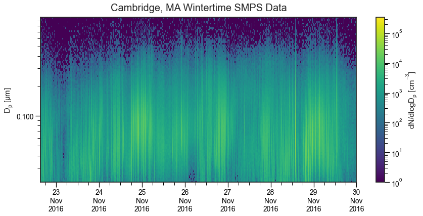

General Usage
=============

*py-smps* is a general-purpose library meant for making the analysis of
size-resolved aerosol data a bit easier. It is not meant to cover all
possible instruments or use cases (at least not yet!). This guide should
give you an overview of the capabilities of the software, but will not
be completely comprehensive. Please read through the API documentation
if you have any questions or post to the discussions on the GitHub
repository.

Importing Data
--------------

The data format for each type of sensor/analyzer is going to be
different depending on manufacturer’s specifications. There are a few
helper functions for common sensors (i.e., the SMPS from TSI), and
generally, we need the data to meet the following requirements:

-  the raw data should be a DataFrame (``pd.DataFrame``). If you’re
   unfamiliar with DataFrame’s in python, it may be a good idea to read
   up on the ``pandas`` library before moving on
-  the index of the DataFrame should be a time series
-  there should be a unique column for every particle size bin

So long as the above requirements are met, you should be able to analyze
any sensor or instrument!

.. code:: ipython3

    import warnings
    import pandas as pd
    import seaborn as sns
    import matplotlib.pyplot as plt
    import matplotlib as mpl
    import smps
    
    sns.set("notebook", style="ticks", font_scale=1.25, palette='colorblind')
    smps.set()
    
    warnings.simplefilter(action='ignore', category=FutureWarning)
    
    %matplotlib inline
    
    print (smps.__version__)

.. parsed-literal::

    2.0.0a2

To get started, we need data! Here, we use the ``smps.io.load_sample``
function to import a sample SMPS data set:

.. code:: ipython3

    # Load the 'boston' example
    bos = smps.io.load_sample("boston")

If you are trying to analyze data from an SMPS, there is a file loader
function available (``smps.io.load_file``); however, each version of the
TSI AIM software is different, making it incredibly difficult to make a
general-purpose loader. If this function doesn’t work for your version
of AIM data outputs, please raise an issue in the GitHub repository and
paste your file and we can come up with a solution.

If your data is simply a csv, you can use native pandas to load your
data and ensure it’s in the correct format. There are also some sample
data files located in the ``tests`` directory if needed.

.. code:: ipython3

    # Load a sample data set from an 
    df = pd.read_csv("https://raw.githubusercontent.com/quant-aq/py-smps/master/tests/datafiles/MOD-PM-SAMPLE.csv")
    
    # Conver the timestamp to be a datetime object
    df["timestamp"] = df["timestamp"].map(pd.to_datetime)
    
    # Set the index to be a timestamp
    df.set_index("timestamp", inplace=True)
    
    df.info()

.. parsed-literal::

    <class 'pandas.core.frame.DataFrame'>
    DatetimeIndex: 1009 entries, 2022-02-15 21:27:30+00:00 to 2022-02-15 04:39:32+00:00
    Data columns (total 54 columns):
     #   Column           Non-Null Count  Dtype  
    ---  ------           --------------  -----  
     0   id               1009 non-null   int64  
     1   timestamp_local  1009 non-null   object 
     2   sn               1009 non-null   object 
     3   sample_rh        1009 non-null   float64
     4   sample_temp      1009 non-null   float64
     5   sample_pres      1009 non-null   int64  
     6   bin0             1009 non-null   float64
     7   bin1             1009 non-null   float64
     8   bin2             1009 non-null   float64
     9   bin3             1009 non-null   float64
     10  bin4             1009 non-null   float64
     11  bin5             1009 non-null   float64
     12  bin6             1009 non-null   float64
     13  bin7             1009 non-null   float64
     14  bin8             1009 non-null   float64
     15  bin9             1009 non-null   float64
     16  bin10            1009 non-null   float64
     17  bin11            1009 non-null   float64
     18  bin12            1009 non-null   float64
     19  bin13            1009 non-null   float64
     20  bin14            1009 non-null   float64
     21  bin15            1009 non-null   float64
     22  bin16            1009 non-null   float64
     23  bin17            1009 non-null   float64
     24  bin18            1009 non-null   float64
     25  bin19            1009 non-null   float64
     26  bin20            1009 non-null   float64
     27  bin21            1009 non-null   int64  
     28  bin22            1009 non-null   int64  
     29  bin23            1009 non-null   float64
     30  opcn3_temp       1009 non-null   int64  
     31  opcn3_rh         1009 non-null   int64  
     32  opcn3_pm1        1009 non-null   float64
     33  opcn3_pm25       1009 non-null   float64
     34  opcn3_pm10       1009 non-null   float64
     35  pm1_env          1009 non-null   float64
     36  pm25_env         1009 non-null   float64
     37  pm10_env         1009 non-null   float64
     38  neph_bin0        1009 non-null   float64
     39  neph_bin1        1009 non-null   float64
     40  neph_bin2        1009 non-null   float64
     41  neph_bin3        1009 non-null   float64
     42  neph_bin4        1009 non-null   int64  
     43  neph_bin5        1009 non-null   int64  
     44  flag             1009 non-null   int64  
     45  lat              1009 non-null   float64
     46  lon              1009 non-null   float64
     47  device_state     1009 non-null   object 
     48  pm10             1009 non-null   float64
     49  pm1_model_id     1009 non-null   int64  
     50  pm25_model_id    1009 non-null   int64  
     51  pm25             1009 non-null   float64
     52  pm10_model_id    1009 non-null   int64  
     53  pm1              1009 non-null   float64
    dtypes: float64(39), int64(12), object(3)
    memory usage: 433.6+ KB

In the data above, from a QuantAQ MODULAIR-PM sensor, you will see that
there are a number of bins labeled in format “bin” - these are the
particle concentrations at various size ranges and is the raw data we
need. You will notice there are quite a few other columns - this is
totally fine! These will all be treated as ‘meta’ columns by the
software.

Now that we have the data in the proper format, we can go ahead and
initiate the ``GenericParticleSizer`` class.

The ``GenericParticleSizer`` Object
-----------------------------------

The heart of the *py-smps* program is the ``GenericParticleSizer``
object. The ``GenericParticleSizer`` is the base class for all available
particle sizing instruments. It contains all of the basic functionality
and methods used for making calculations and/or figures. To initialize
the object, you must provide the ``data`` and ``bins`` arguments.
``data`` must be a pandas DataFrame with a datetime index, and ``bins``
must be a 3xn array including the left boundary, midpoint, and right
boundary for each size bin. **NOTE: There is a helper function to make
the 3xn array from a list of endpoints (see ``smps.utils.make_bins``)**.

There are several additional classes that inherit directly from the
``GenericParticleSizer`` pertaining to individual products. As of
February 2022, these include:

-  ``SMPS``
-  ``Grimm11D``
-  ``POPS``
-  ``ParticlesPlus``
-  ``AlphasenseOPCN2``
-  ``AlphasenseOPCN3``
-  ``Modulair``
-  ``ModulairPM``

We will use the above MODULAIR-PM data we loaded to walk through some of
the functionality of the ``GenericParticleSizer`` class. We will begin
by exploring some of the models attributes before moving on to the
methods.

Attributes
~~~~~~~~~~

First, we will initialize the object:

.. code:: ipython3

    obj = smps.models.ModulairPM(data=df)

To start, you can access the bins for the device using the ``bins``
attribute:

.. code:: ipython3

    obj.bins

.. parsed-literal::

    array([[ 0.35 ,  0.405,  0.46 ],
           [ 0.46 ,  0.56 ,  0.66 ],
           [ 0.66 ,  0.83 ,  1.   ],
           [ 1.   ,  1.15 ,  1.3  ],
           [ 1.3  ,  1.5  ,  1.7  ],
           [ 1.7  ,  2.   ,  2.3  ],
           [ 2.3  ,  2.65 ,  3.   ],
           [ 3.   ,  3.5  ,  4.   ],
           [ 4.   ,  4.6  ,  5.2  ],
           [ 5.2  ,  5.85 ,  6.5  ],
           [ 6.5  ,  7.25 ,  8.   ],
           [ 8.   ,  9.   , 10.   ],
           [10.   , 11.   , 12.   ],
           [12.   , 13.   , 14.   ],
           [14.   , 15.   , 16.   ],
           [16.   , 17.   , 18.   ],
           [18.   , 19.   , 20.   ],
           [20.   , 21.   , 22.   ],
           [22.   , 23.5  , 25.   ],
           [25.   , 26.5  , 28.   ],
           [28.   , 29.5  , 31.   ],
           [31.   , 32.5  , 34.   ],
           [34.   , 35.5  , 37.   ],
           [37.   , 38.5  , 40.   ]])

You can access just the midpoints using the ``midpoints`` attribute:

.. code:: ipython3

    obj.midpoints

.. parsed-literal::

    array([ 0.405,  0.56 ,  0.83 ,  1.15 ,  1.5  ,  2.   ,  2.65 ,  3.5  ,
            4.6  ,  5.85 ,  7.25 ,  9.   , 11.   , 13.   , 15.   , 17.   ,
           19.   , 21.   , 23.5  , 26.5  , 29.5  , 32.5  , 35.5  , 38.5  ])

To access any meta data/additional columns that do not belong as the raw
data, use the ``scan_stats`` attribute:

.. code:: ipython3

    obj.scan_stats.head()

.. raw:: html

    

    
    <table border="1" class="dataframe">
      <thead>
        <tr style="text-align: right;">
          <th></th>
          <th>pm1_env</th>
          <th>device_state</th>
          <th>pm25_env</th>
          <th>pm1</th>
          <th>id</th>
          <th>pm10_model_id</th>
          <th>pm10_env</th>
          <th>sample_pres</th>
          <th>neph_bin4</th>
          <th>sample_temp</th>
          <th>...</th>
          <th>opcn3_temp</th>
          <th>lon</th>
          <th>lat</th>
          <th>opcn3_pm10</th>
          <th>opcn3_pm25</th>
          <th>neph_bin2</th>
          <th>pm25_model_id</th>
          <th>sample_rh</th>
          <th>timestamp_local</th>
          <th>flag</th>
        </tr>
        <tr>
          <th>timestamp</th>
          <th></th>
          <th></th>
          <th></th>
          <th></th>
          <th></th>
          <th></th>
          <th></th>
          <th></th>
          <th></th>
          <th></th>
          <th></th>
          <th></th>
          <th></th>
          <th></th>
          <th></th>
          <th></th>
          <th></th>
          <th></th>
          <th></th>
          <th></th>
          <th></th>
        </tr>
      </thead>
      <tbody>
        <tr>
          <th>2022-02-15 21:27:30+00:00</th>
          <td>0.0</td>
          <td>ACTIVE</td>
          <td>0.0</td>
          <td>0.3809</td>
          <td>87893809</td>
          <td>3382</td>
          <td>0.0</td>
          <td>0</td>
          <td>0</td>
          <td>7.00</td>
          <td>...</td>
          <td>0</td>
          <td>-103.757</td>
          <td>44.347</td>
          <td>2.99</td>
          <td>0.74</td>
          <td>0.0</td>
          <td>3381</td>
          <td>38.69</td>
          <td>2022-02-15T14:27:30Z</td>
          <td>0</td>
        </tr>
        <tr>
          <th>2022-02-15 21:26:30+00:00</th>
          <td>0.0</td>
          <td>ACTIVE</td>
          <td>0.0</td>
          <td>0.3383</td>
          <td>87893808</td>
          <td>3382</td>
          <td>0.0</td>
          <td>0</td>
          <td>0</td>
          <td>6.99</td>
          <td>...</td>
          <td>0</td>
          <td>-103.757</td>
          <td>44.347</td>
          <td>1.30</td>
          <td>0.92</td>
          <td>0.0</td>
          <td>3381</td>
          <td>37.76</td>
          <td>2022-02-15T14:26:30Z</td>
          <td>0</td>
        </tr>
        <tr>
          <th>2022-02-15 21:25:30+00:00</th>
          <td>0.0</td>
          <td>ACTIVE</td>
          <td>0.0</td>
          <td>0.3091</td>
          <td>87893807</td>
          <td>3382</td>
          <td>0.0</td>
          <td>0</td>
          <td>0</td>
          <td>6.98</td>
          <td>...</td>
          <td>0</td>
          <td>-103.757</td>
          <td>44.347</td>
          <td>2.79</td>
          <td>0.89</td>
          <td>0.0</td>
          <td>3381</td>
          <td>38.05</td>
          <td>2022-02-15T14:25:30Z</td>
          <td>0</td>
        </tr>
        <tr>
          <th>2022-02-15 21:24:30+00:00</th>
          <td>0.0</td>
          <td>ACTIVE</td>
          <td>0.0</td>
          <td>0.4380</td>
          <td>87893804</td>
          <td>3382</td>
          <td>0.0</td>
          <td>0</td>
          <td>0</td>
          <td>6.97</td>
          <td>...</td>
          <td>0</td>
          <td>-103.757</td>
          <td>44.347</td>
          <td>2.13</td>
          <td>0.88</td>
          <td>0.0</td>
          <td>3381</td>
          <td>38.84</td>
          <td>2022-02-15T14:24:30Z</td>
          <td>0</td>
        </tr>
        <tr>
          <th>2022-02-15 21:23:30+00:00</th>
          <td>0.0</td>
          <td>ACTIVE</td>
          <td>0.0</td>
          <td>0.4511</td>
          <td>87893803</td>
          <td>3382</td>
          <td>0.0</td>
          <td>0</td>
          <td>0</td>
          <td>6.95</td>
          <td>...</td>
          <td>0</td>
          <td>-103.757</td>
          <td>44.347</td>
          <td>2.34</td>
          <td>0.94</td>
          <td>0.0</td>
          <td>3381</td>
          <td>38.97</td>
          <td>2022-02-15T14:23:30Z</td>
          <td>0</td>
        </tr>
      </tbody>
    </table>
    
5 rows × 30 columns

    

Finally, there are a number of dataframes available that should provide
access to all sorts of fun data. These include:

-  ``dn`` - particle number concentration by bin
-  ``ds`` - surface area by bin
-  ``dv`` - volume by bin
-  ``dndlogdp`` - normalized number by bin
-  ``dsdlogdp`` - normalized surface area by bin
-  ``dvdlogdp`` - normalized volume by bin

Here, we show the number concentration by bin as an example:

.. code:: ipython3

    obj.dn.head()

.. raw:: html

    

    
    <table border="1" class="dataframe">
      <thead>
        <tr style="text-align: right;">
          <th></th>
          <th>bin0</th>
          <th>bin1</th>
          <th>bin2</th>
          <th>bin3</th>
          <th>bin4</th>
          <th>bin5</th>
          <th>bin6</th>
          <th>bin7</th>
          <th>bin8</th>
          <th>bin9</th>
          <th>...</th>
          <th>bin14</th>
          <th>bin15</th>
          <th>bin16</th>
          <th>bin17</th>
          <th>bin18</th>
          <th>bin19</th>
          <th>bin20</th>
          <th>bin21</th>
          <th>bin22</th>
          <th>bin23</th>
        </tr>
        <tr>
          <th>timestamp</th>
          <th></th>
          <th></th>
          <th></th>
          <th></th>
          <th></th>
          <th></th>
          <th></th>
          <th></th>
          <th></th>
          <th></th>
          <th></th>
          <th></th>
          <th></th>
          <th></th>
          <th></th>
          <th></th>
          <th></th>
          <th></th>
          <th></th>
          <th></th>
          <th></th>
        </tr>
      </thead>
      <tbody>
        <tr>
          <th>2022-02-15 21:27:30+00:00</th>
          <td>1.5300</td>
          <td>0.2194</td>
          <td>0.0579</td>
          <td>0.0064</td>
          <td>0.0097</td>
          <td>0.0129</td>
          <td>0.0129</td>
          <td>0.0032</td>
          <td>0.0033</td>
          <td>0.0000</td>
          <td>...</td>
          <td>0.0</td>
          <td>0.0</td>
          <td>0.0</td>
          <td>0.0</td>
          <td>0.0</td>
          <td>0.0</td>
          <td>0.0</td>
          <td>0.0</td>
          <td>0.0</td>
          <td>0.0</td>
        </tr>
        <tr>
          <th>2022-02-15 21:26:30+00:00</th>
          <td>1.6633</td>
          <td>0.1843</td>
          <td>0.0811</td>
          <td>0.0225</td>
          <td>0.0228</td>
          <td>0.0227</td>
          <td>0.0163</td>
          <td>0.0000</td>
          <td>0.0000</td>
          <td>0.0000</td>
          <td>...</td>
          <td>0.0</td>
          <td>0.0</td>
          <td>0.0</td>
          <td>0.0</td>
          <td>0.0</td>
          <td>0.0</td>
          <td>0.0</td>
          <td>0.0</td>
          <td>0.0</td>
          <td>0.0</td>
        </tr>
        <tr>
          <th>2022-02-15 21:25:30+00:00</th>
          <td>1.6052</td>
          <td>0.1605</td>
          <td>0.0767</td>
          <td>0.0134</td>
          <td>0.0132</td>
          <td>0.0133</td>
          <td>0.0201</td>
          <td>0.0033</td>
          <td>0.0033</td>
          <td>0.0033</td>
          <td>...</td>
          <td>0.0</td>
          <td>0.0</td>
          <td>0.0</td>
          <td>0.0</td>
          <td>0.0</td>
          <td>0.0</td>
          <td>0.0</td>
          <td>0.0</td>
          <td>0.0</td>
          <td>0.0</td>
        </tr>
        <tr>
          <th>2022-02-15 21:24:30+00:00</th>
          <td>1.7815</td>
          <td>0.1700</td>
          <td>0.0565</td>
          <td>0.0134</td>
          <td>0.0233</td>
          <td>0.0334</td>
          <td>0.0034</td>
          <td>0.0033</td>
          <td>0.0000</td>
          <td>0.0033</td>
          <td>...</td>
          <td>0.0</td>
          <td>0.0</td>
          <td>0.0</td>
          <td>0.0</td>
          <td>0.0</td>
          <td>0.0</td>
          <td>0.0</td>
          <td>0.0</td>
          <td>0.0</td>
          <td>0.0</td>
        </tr>
        <tr>
          <th>2022-02-15 21:23:30+00:00</th>
          <td>1.5870</td>
          <td>0.1782</td>
          <td>0.0519</td>
          <td>0.0193</td>
          <td>0.0258</td>
          <td>0.0164</td>
          <td>0.0162</td>
          <td>0.0033</td>
          <td>0.0065</td>
          <td>0.0000</td>
          <td>...</td>
          <td>0.0</td>
          <td>0.0</td>
          <td>0.0</td>
          <td>0.0</td>
          <td>0.0</td>
          <td>0.0</td>
          <td>0.0</td>
          <td>0.0</td>
          <td>0.0</td>
          <td>0.0</td>
        </tr>
      </tbody>
    </table>
    
5 rows × 24 columns

    

Methods
~~~~~~~

There are several primary methods available under the
``GenericParticleSizer``, including:

-  ``copy`` - create a copy of the existing model
-  ``resample`` - resample the data to be on a different time basis
-  ``slice`` - slice the data between specific start and stop times
-  ``stats`` - calculate the total number of particles, surface area,
   volume, and mass
-  ``dump`` - save a copy of the model to file
-  ``integrate`` - calculate the total number, surface area, volume, or
   mass of particles between two diameters

Above, our data is on a 1-minute time base. What if we want it on a
15min time base? No problem! Use ``resample``:

.. code:: ipython3

    obj.resample("15min", inplace=True)
    
    # Show the results
    obj.dn.head()

.. raw:: html

    

    
    <table border="1" class="dataframe">
      <thead>
        <tr style="text-align: right;">
          <th></th>
          <th>bin0</th>
          <th>bin1</th>
          <th>bin2</th>
          <th>bin3</th>
          <th>bin4</th>
          <th>bin5</th>
          <th>bin6</th>
          <th>bin7</th>
          <th>bin8</th>
          <th>bin9</th>
          <th>...</th>
          <th>bin14</th>
          <th>bin15</th>
          <th>bin16</th>
          <th>bin17</th>
          <th>bin18</th>
          <th>bin19</th>
          <th>bin20</th>
          <th>bin21</th>
          <th>bin22</th>
          <th>bin23</th>
        </tr>
        <tr>
          <th>timestamp</th>
          <th></th>
          <th></th>
          <th></th>
          <th></th>
          <th></th>
          <th></th>
          <th></th>
          <th></th>
          <th></th>
          <th></th>
          <th></th>
          <th></th>
          <th></th>
          <th></th>
          <th></th>
          <th></th>
          <th></th>
          <th></th>
          <th></th>
          <th></th>
          <th></th>
        </tr>
      </thead>
      <tbody>
        <tr>
          <th>2022-02-15 04:30:00+00:00</th>
          <td>1.105550</td>
          <td>0.109533</td>
          <td>0.040883</td>
          <td>0.016667</td>
          <td>0.022717</td>
          <td>0.022333</td>
          <td>0.012500</td>
          <td>0.003517</td>
          <td>0.005533</td>
          <td>0.000683</td>
          <td>...</td>
          <td>0.00000</td>
          <td>0.0</td>
          <td>0.0</td>
          <td>0.0</td>
          <td>0.0</td>
          <td>0.0</td>
          <td>0.0</td>
          <td>0.0</td>
          <td>0.0</td>
          <td>0.0</td>
        </tr>
        <tr>
          <th>2022-02-15 04:45:00+00:00</th>
          <td>1.182547</td>
          <td>0.130220</td>
          <td>0.059053</td>
          <td>0.020747</td>
          <td>0.025300</td>
          <td>0.025133</td>
          <td>0.018687</td>
          <td>0.008420</td>
          <td>0.005493</td>
          <td>0.004027</td>
          <td>...</td>
          <td>0.00000</td>
          <td>0.0</td>
          <td>0.0</td>
          <td>0.0</td>
          <td>0.0</td>
          <td>0.0</td>
          <td>0.0</td>
          <td>0.0</td>
          <td>0.0</td>
          <td>0.0</td>
        </tr>
        <tr>
          <th>2022-02-15 05:00:00+00:00</th>
          <td>1.136227</td>
          <td>0.130833</td>
          <td>0.061033</td>
          <td>0.019687</td>
          <td>0.029427</td>
          <td>0.022347</td>
          <td>0.021953</td>
          <td>0.013173</td>
          <td>0.007527</td>
          <td>0.004247</td>
          <td>...</td>
          <td>0.00034</td>
          <td>0.0</td>
          <td>0.0</td>
          <td>0.0</td>
          <td>0.0</td>
          <td>0.0</td>
          <td>0.0</td>
          <td>0.0</td>
          <td>0.0</td>
          <td>0.0</td>
        </tr>
        <tr>
          <th>2022-02-15 05:15:00+00:00</th>
          <td>1.105267</td>
          <td>0.133547</td>
          <td>0.061113</td>
          <td>0.017760</td>
          <td>0.022253</td>
          <td>0.018500</td>
          <td>0.014573</td>
          <td>0.007373</td>
          <td>0.004787</td>
          <td>0.003413</td>
          <td>...</td>
          <td>0.00000</td>
          <td>0.0</td>
          <td>0.0</td>
          <td>0.0</td>
          <td>0.0</td>
          <td>0.0</td>
          <td>0.0</td>
          <td>0.0</td>
          <td>0.0</td>
          <td>0.0</td>
        </tr>
        <tr>
          <th>2022-02-15 05:30:00+00:00</th>
          <td>1.130513</td>
          <td>0.146707</td>
          <td>0.051440</td>
          <td>0.015280</td>
          <td>0.029167</td>
          <td>0.018653</td>
          <td>0.017687</td>
          <td>0.005367</td>
          <td>0.008973</td>
          <td>0.004087</td>
          <td>...</td>
          <td>0.00030</td>
          <td>0.0</td>
          <td>0.0</td>
          <td>0.0</td>
          <td>0.0</td>
          <td>0.0</td>
          <td>0.0</td>
          <td>0.0</td>
          <td>0.0</td>
          <td>0.0</td>
        </tr>
      </tbody>
    </table>
    
5 rows × 24 columns

    

What if we want to count the total number of particles between 0 µm and
1 µm?

.. code:: ipython3

    obj.integrate(weight='number', dmin=0., dmax=1.)

.. parsed-literal::

    timestamp
    2022-02-15 04:30:00+00:00    1.255967
    2022-02-15 04:45:00+00:00    1.371820
    2022-02-15 05:00:00+00:00    1.328093
    2022-02-15 05:15:00+00:00    1.299927
    2022-02-15 05:30:00+00:00    1.328660
                                   ...   
    2022-02-15 20:15:00+00:00    2.883060
    2022-02-15 20:30:00+00:00    3.390260
    2022-02-15 20:45:00+00:00    3.246453
    2022-02-15 21:00:00+00:00    2.537080
    2022-02-15 21:15:00+00:00    2.039631
    Freq: 15T, Length: 68, dtype: float64

What about computing PM2.5?

.. code:: ipython3

    obj.integrate(weight='mass', dmin=0., dmax=2.5, rho=1.65)

.. parsed-literal::

    timestamp
    2022-02-15 04:30:00+00:00    0.400176
    2022-02-15 04:45:00+00:00    0.477374
    2022-02-15 05:00:00+00:00    0.482173
    2022-02-15 05:15:00+00:00    0.396912
    2022-02-15 05:30:00+00:00    0.427840
                                   ...   
    2022-02-15 20:15:00+00:00    0.498427
    2022-02-15 20:30:00+00:00    0.581254
    2022-02-15 20:45:00+00:00    0.552808
    2022-02-15 21:00:00+00:00    0.551263
    2022-02-15 21:15:00+00:00    0.468123
    Freq: 15T, Length: 68, dtype: float64

The ``integrate`` method can also be incredibly useful if you are trying
to calculate the total number of particles between two random diameters
- say, you’re trying to compare a low-cost optical particle counter with
large bins to an SMPS with small bins. No problem!

.. code:: ipython3

    obj.integrate(weight='number', dmin=0.54, dmax=1.05)

.. parsed-literal::

    timestamp
    2022-02-15 04:30:00+00:00    0.109381
    2022-02-15 04:45:00+00:00    0.140643
    2022-02-15 05:00:00+00:00    0.142814
    2022-02-15 05:15:00+00:00    0.144201
    2022-02-15 05:30:00+00:00    0.142011
                                   ...   
    2022-02-15 20:15:00+00:00    0.240967
    2022-02-15 20:30:00+00:00    0.288473
    2022-02-15 20:45:00+00:00    0.284831
    2022-02-15 21:00:00+00:00    0.230808
    2022-02-15 21:15:00+00:00    0.194771
    Freq: 15T, Length: 68, dtype: float64

Next, let’s go ahead and compute the statistics! The ``stats`` method
will compute the total number of particles, total surface area, total
volume, total mass, arithmetic mean diameter, geometric mean diameter,
mode diameter, and geometric standard deviation. **NOTE: This
computation can take a little while if your data set is extremely
large.**

.. code:: ipython3

    obj.stats(weight='number')

.. raw:: html

    

    
    <table border="1" class="dataframe">
      <thead>
        <tr style="text-align: right;">
          <th></th>
          <th>number</th>
          <th>surface_area</th>
          <th>volume</th>
          <th>mass</th>
          <th>AM</th>
          <th>GM</th>
          <th>Mode</th>
          <th>GSD</th>
        </tr>
        <tr>
          <th>timestamp</th>
          <th></th>
          <th></th>
          <th></th>
          <th></th>
          <th></th>
          <th></th>
          <th></th>
          <th></th>
        </tr>
      </thead>
      <tbody>
        <tr>
          <th>2022-02-15 04:30:00+00:00</th>
          <td>1.343367</td>
          <td>3.227322</td>
          <td>2.713203</td>
          <td>4.476784</td>
          <td>558.199238</td>
          <td>471.739692</td>
          <td>405.0</td>
          <td>1.537061</td>
        </tr>
        <tr>
          <th>2022-02-15 04:45:00+00:00</th>
          <td>1.483933</td>
          <td>4.033648</td>
          <td>2.903223</td>
          <td>4.790318</td>
          <td>591.934184</td>
          <td>485.830530</td>
          <td>405.0</td>
          <td>1.604479</td>
        </tr>
        <tr>
          <th>2022-02-15 05:00:00+00:00</th>
          <td>1.450407</td>
          <td>4.526602</td>
          <td>3.650987</td>
          <td>6.024129</td>
          <td>617.932074</td>
          <td>495.497711</td>
          <td>405.0</td>
          <td>1.653602</td>
        </tr>
        <tr>
          <th>2022-02-15 05:15:00+00:00</th>
          <td>1.391673</td>
          <td>3.438754</td>
          <td>2.554663</td>
          <td>4.215193</td>
          <td>573.767215</td>
          <td>480.501450</td>
          <td>405.0</td>
          <td>1.562774</td>
        </tr>
        <tr>
          <th>2022-02-15 05:30:00+00:00</th>
          <td>1.430673</td>
          <td>3.650599</td>
          <td>2.520790</td>
          <td>4.159304</td>
          <td>584.194505</td>
          <td>483.785319</td>
          <td>405.0</td>
          <td>1.587822</td>
        </tr>
        <tr>
          <th>...</th>
          <td>...</td>
          <td>...</td>
          <td>...</td>
          <td>...</td>
          <td>...</td>
          <td>...</td>
          <td>...</td>
          <td>...</td>
        </tr>
        <tr>
          <th>2022-02-15 20:15:00+00:00</th>
          <td>2.969867</td>
          <td>3.391759</td>
          <td>1.191135</td>
          <td>1.965372</td>
          <td>481.056344</td>
          <td>444.705598</td>
          <td>405.0</td>
          <td>1.351818</td>
        </tr>
        <tr>
          <th>2022-02-15 20:30:00+00:00</th>
          <td>3.487507</td>
          <td>4.304874</td>
          <td>3.049257</td>
          <td>5.031274</td>
          <td>479.990327</td>
          <td>444.117798</td>
          <td>405.0</td>
          <td>1.345173</td>
        </tr>
        <tr>
          <th>2022-02-15 20:45:00+00:00</th>
          <td>3.341367</td>
          <td>3.884852</td>
          <td>2.109773</td>
          <td>3.481126</td>
          <td>478.492264</td>
          <td>444.450183</td>
          <td>405.0</td>
          <td>1.339386</td>
        </tr>
        <tr>
          <th>2022-02-15 21:00:00+00:00</th>
          <td>2.652347</td>
          <td>5.447377</td>
          <td>4.857831</td>
          <td>8.015421</td>
          <td>527.360551</td>
          <td>458.764700</td>
          <td>405.0</td>
          <td>1.464325</td>
        </tr>
        <tr>
          <th>2022-02-15 21:15:00+00:00</th>
          <td>2.131215</td>
          <td>4.112106</td>
          <td>5.563257</td>
          <td>9.179373</td>
          <td>517.081279</td>
          <td>458.002189</td>
          <td>405.0</td>
          <td>1.437623</td>
        </tr>
      </tbody>
    </table>
    
68 rows × 8 columns

    

You can also weight it differently if you so choose! If you want the
volume-weighted geometric mean diameter:

.. code:: ipython3

    obj.stats(weight='volume')

.. raw:: html

    

    
    <table border="1" class="dataframe">
      <thead>
        <tr style="text-align: right;">
          <th></th>
          <th>number</th>
          <th>surface_area</th>
          <th>volume</th>
          <th>mass</th>
          <th>AM</th>
          <th>GM</th>
          <th>Mode</th>
          <th>GSD</th>
        </tr>
        <tr>
          <th>timestamp</th>
          <th></th>
          <th></th>
          <th></th>
          <th></th>
          <th></th>
          <th></th>
          <th></th>
          <th></th>
        </tr>
      </thead>
      <tbody>
        <tr>
          <th>2022-02-15 04:30:00+00:00</th>
          <td>1.343367</td>
          <td>3.227322</td>
          <td>2.713203</td>
          <td>4.476784</td>
          <td>8892.491253</td>
          <td>7497.921953</td>
          <td>13000.0</td>
          <td>2.025142</td>
        </tr>
        <tr>
          <th>2022-02-15 04:45:00+00:00</th>
          <td>1.483933</td>
          <td>4.033648</td>
          <td>2.903223</td>
          <td>4.790318</td>
          <td>6875.914604</td>
          <td>5916.255119</td>
          <td>9000.0</td>
          <td>1.904198</td>
        </tr>
        <tr>
          <th>2022-02-15 05:00:00+00:00</th>
          <td>1.450407</td>
          <td>4.526602</td>
          <td>3.650987</td>
          <td>6.024129</td>
          <td>8287.559782</td>
          <td>6821.740936</td>
          <td>15000.0</td>
          <td>2.025214</td>
        </tr>
        <tr>
          <th>2022-02-15 05:15:00+00:00</th>
          <td>1.391673</td>
          <td>3.438754</td>
          <td>2.554663</td>
          <td>4.215193</td>
          <td>7810.609787</td>
          <td>6471.306120</td>
          <td>13000.0</td>
          <td>2.039193</td>
        </tr>
        <tr>
          <th>2022-02-15 05:30:00+00:00</th>
          <td>1.430673</td>
          <td>3.650599</td>
          <td>2.520790</td>
          <td>4.159304</td>
          <td>7326.109059</td>
          <td>5911.381732</td>
          <td>15000.0</td>
          <td>2.064738</td>
        </tr>
        <tr>
          <th>...</th>
          <td>...</td>
          <td>...</td>
          <td>...</td>
          <td>...</td>
          <td>...</td>
          <td>...</td>
          <td>...</td>
          <td>...</td>
        </tr>
        <tr>
          <th>2022-02-15 20:15:00+00:00</th>
          <td>2.969867</td>
          <td>3.391759</td>
          <td>1.191135</td>
          <td>1.965372</td>
          <td>4485.808228</td>
          <td>3439.123104</td>
          <td>5850.0</td>
          <td>2.365414</td>
        </tr>
        <tr>
          <th>2022-02-15 20:30:00+00:00</th>
          <td>3.487507</td>
          <td>4.304874</td>
          <td>3.049257</td>
          <td>5.031274</td>
          <td>15018.669990</td>
          <td>10087.884711</td>
          <td>23500.0</td>
          <td>3.030722</td>
        </tr>
        <tr>
          <th>2022-02-15 20:45:00+00:00</th>
          <td>3.341367</td>
          <td>3.884852</td>
          <td>2.109773</td>
          <td>3.481126</td>
          <td>10656.041200</td>
          <td>7136.577292</td>
          <td>19000.0</td>
          <td>2.964750</td>
        </tr>
        <tr>
          <th>2022-02-15 21:00:00+00:00</th>
          <td>2.652347</td>
          <td>5.447377</td>
          <td>4.857831</td>
          <td>8.015421</td>
          <td>11381.347034</td>
          <td>8835.742721</td>
          <td>21000.0</td>
          <td>2.287378</td>
        </tr>
        <tr>
          <th>2022-02-15 21:15:00+00:00</th>
          <td>2.131215</td>
          <td>4.112106</td>
          <td>5.563257</td>
          <td>9.179373</td>
          <td>21901.384630</td>
          <td>16731.056626</td>
          <td>29500.0</td>
          <td>2.537144</td>
        </tr>
      </tbody>
    </table>
    
68 rows × 8 columns

    

Finally, if you want to save your model so that you don’t have to re-do
your work later, you can use the ``dump`` method:

.. code:: ipython3

    obj.dump("obj-modulair-pm.sav")

.. parsed-literal::

    ['obj-modulair-pm.sav']

Visualization
-------------

Making common figures is easy with ``py-smps``. There are two primary,
out-of-the-box figures that can be made:

-  ``smps.plots.histplot``
-  ``smps.plots.heatmap``

These plots are all made using ``matplotlib``, so you can easily modify
them or create your own.

Heatmap
~~~~~~~

The heatmap function makes it easy to visualize how the particle size
distribution is changing over time, allowing you to observe
growth/nucleation events, etc. To use the ``heatmap`` function, you must
provide three arguments:

-  ``X``: the time axis
-  ``Y``: the bin midpoints
-  ``Z``: the data you wish to plot, typically ``obj.dndlogdp``

You may not agree with the default colormap choice (``viridis``), but
you can easily change that as you see fit. Please don’t use ``jet``!

.. code:: ipython3

    X = bos.dndlogdp.index
    Y = bos.midpoints
    Z = bos.dndlogdp.T.values
    
    ax = smps.plots.heatmap(
        X, Y, Z,
        cmap='viridis',
        fig_kws=dict(figsize=(14, 6))
    )
    
    # Let's make the x-axis look a little nicer
    import matplotlib.dates as dates
    
    ax.xaxis.set_minor_locator(dates.HourLocator(byhour=[0, 6, 12, 18]))
    ax.xaxis.set_major_formatter(dates.DateFormatter("%d\n%b\n%Y"))
    
    # Go ahead and change things!
    ax.set_title("Cambridge, MA Wintertime SMPS Data", y=1.02, fontsize=20);

.. parsed-literal::

    Text(0.5, 1.02, 'Cambridge, MA Wintertime SMPS Data')

Particle Size Distribution
~~~~~~~~~~~~~~~~~~~~~~~~~~

To visualize the particle size distribution, use the
``smps.plots.histplot`` function. To plot the histogram, you must
provide two pieces of information:

1. ``histogram`` - your histogram data! it can be provided as an array
   or as a dataframe in which case it will be averaged over time
2. ``bins`` - you must provide an array of the bins

There are plenty of ways to customize these plots by providing keyword
arguments for the matplotlib bar chart (``plot_kws``) or the figure
itself (``fig_kws``). You can also plot onto an existing axis by
providing the axis as an argument.

Here, we will make a simply plot showing the Boston dataset from the
beginning of this tutorial (it’s more exciting than a low-cost OPC!):

.. code:: ipython3

    ax = smps.plots.histplot(
        bos.dndlogdp, 
        bos.bins, 
        plot_kws=dict(linewidth=0.01),
        fig_kws=dict(figsize=(12, 6))
    )
    
    # Set the title and y-axis label
    ax.set_title("Cambridge, MA Wintertime Particle Size Distribution", y=1.05, fontsize=20)
    ax.set_ylabel("$dN/dlogD_p \; [cm^{-3}]$")
    
    # Remove the right and top spines
    sns.despine()

Next, let’s plot the same data, but plot the particle size distribution
for each day separately.

.. code:: ipython3

    import itertools
    
    dates = ["2016-11-23", "2016-11-24", "2016-11-25"]
    
    ax = None
    cp = itertools.cycle(sns.color_palette())
    
    for date in dates: 
        ax = smps.plots.histplot(
            bos.dndlogdp[date],
            bos.bins,
            ax=ax,
            plot_kws=dict(alpha=0.6, color=next(cp), linewidth=0.),
            fig_kws=dict(figsize=(12, 6))
        )
        
    # Add a legend
    ax.legend(dates, loc='best')
    
    # Set the axis label
    ax.set_ylabel("$dN/dlogD_p \; [cm^{-3}]$")
    
    # Remove the right and top spines
    sns.despine()

That about covers the general overview! Feel free to check out the guide
on curve fitting next.

